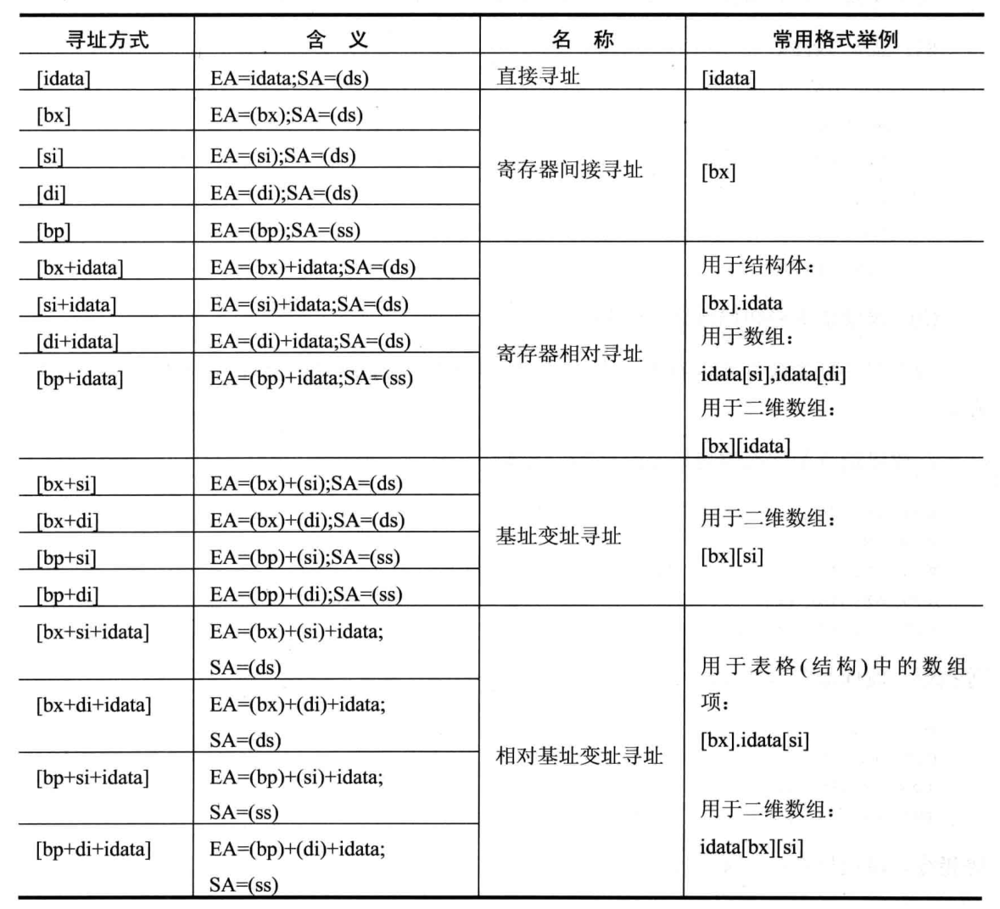

####
- 不同的CPU寄存器的个数,结构是不相同的.8086CPU有14个寄存器,每个寄存器有一个名称.这些寄存器是
AX
BX
CX
DX
SI
DI

SP  
BP
IP
CS  (CS IP)
SS  (SS SP)
DS  (DS BX)
ES
PSW
#### 2.1通用寄存器
- 8086CPU 的所有寄存器是16位,可以存放两个字节,AX,BX,CX,DX这4个寄存器通常用来存放一般性数据,被称为通用
寄存器
- 8086CPU的上一代CPU的寄存器都是8位,为了保证兼容,使原来基于上代CPU编写的程序稍加修改就可以运行在8086CPU上,
8086CPU的
```code
AX可分为AH,AL(AL的低8位构成了AL寄存器高8位构成了AH寄存器,AH和AL寄存器是可以独立使用的8位寄存器)
BX可分为BH,BL
CX可分为CH,CL
DX可分为DH,DL
```
这四个寄存器都可以分为两个可独立使用的8位寄存器来用.
#### 7.6 用[bx+idata]的方式进行数组的处理
- 有了[bx+idata]这种表示内存单元的方式,我们就可以用更高级的结构来看待所要处理的数据.
```code
在codesg中写代码,将datasg中定义的第一个字符串转化为大写,第二个字符串转成小写.
assume  cs:codesg,ds:datasg
datasg segment
 db 'BaSiC'
 db 'MinIx'
datasg ends
codesg segment
   start:
codesg ends
end start

原来的方法,用[bx]的方式定位字符串的字符,代码段中的程序如下.
    mov ax,datasg
    mov ds,ax
    mov bx,0
    mov cx,5
  S:mov a1,[bx]
    and a1,110111111b
    mov [bx],a1
    inc bx
    loop s
    
    mov bx,5
    mov cx,5
 s0:mov a1,[bx]
    or a1,00100000b
    mov [bx],a1
    inc bx
    loop s0
- 现在有了[bx+idata的方式],就可以用更简化的方法来完成上面的程序.datasg段的两个字符串,一个的起始
地址为0,一个起始地址为5.可以用[0+bx],[5+bx]的方式在同一个循环中定位这两个字符串中的字符.
    mov ax,datasg
    mov ds,ax
    mov bx,0
 S: mov a1,[0+bx]  #0[bx]
    mov [0+bx],a1
    and a1,00100000b
    mov a1,[5+bx]
    or a1,110111111b
    mov [5+bx],a1
    inc bx
    loop s
  如果用高级语言,比如c语言来描述上面的程序
  char a[5]="BASIC"
  char b[5]="MInIx"
  main(){
  int i;
  i=0;
  do{
     a[i]=a[i]&0xDF;
     b[i]=b[i]|0x20
     i++;
  }while(i<5);
  }  
  
  它们定位字符串中字符的方式
  c语言: a[i],b[i]
  汇编语言:0[bx],5[bx]
  通过比较,我们可以发现,[bx+idata]的方式为高级语言和数组提供了便利机制.
```
#### 7.7 SI和DI
- SI和DI是8086CPU中和bx功能相近的寄存器,si和di不能分成两个8位寄存器来使用.下面的3组指令实现了相同的功能
```code
mov bx,0
mov ax,[bx]  #mov ax,[bx+123]

mov si,0
mov ax,[si]  #mov ax,[si+123]

mov di,0
mov ax,[di]  #mov ax,[di+123]
```
#### 7.8 [bx+si]和[bx+di]
- 在前面用[bx(si或di)]和[bx(si或di)+idata]的方式来指明一个内存单元,我们还可以用更灵活的方式:
[bx+si]和[bx+di]
```code
mov ax,[bx+si]
将一个内存单元的内容送入ax,这个内存单元的长度为2字节(字单元),存放一个字,偏移地址为bx的数值加上
si中的数值,段地址在ds中.
```
#### 7.9 [bx+si+idata]和[bx+di+idata]
```code
[bx+si+idata]和[bx+di+idata]含义相似
[bx+si+idata]表示一个内存单元,它的偏移地址为bx+si+idata(即bx中的数值加上si中的数值再加上idata)
mov ax,[bx+si+idata]的含义如下
将一个内存单元的内容送入ax,这个内存单元的长度为2字节(字单元),存放一个字,偏移地址为bx的数值加上
si中的数值再加上idata,段地址在ds中.
```
#### 7.10 不同的寻址方式的灵活应用.
- 如果我们比较一下前面用到的几种定位内存地址的方法(可称为寻址方式),就可以发现:
```java
1. [idata]用一个常量表示地址,可以用变量直接定位一个内存单元
2. [bx]用一个变量来表示内存地址,可用变量间接定位一个内存单元
3. [bx+idata]用一个变量和常量表示地址,可在一个起始地址的基础上用变量间接定位一个内存单元
4. [bx+si]有两个变量表示地址
5. [bx+si+idata]用两个变量和一个常量表示地址
可以看到,从[idata]一直到[bx+si+idata],我们可以用更加灵活的方式来定位一个内存单元的地址.这使我们
可以从更加结构化的角度来看待所要处理的数据.
```
### 第8章 数据处理的两个基本问题
- 计算机是进行数据处理,运算的机器,那么有两个基本的问题就包含在其中
  1. 处理的数据在什么地方
  2. 要处理的数据有多长
- 在机器指令中,这两个指令必须给以明确或隐含的说明,否则计算机无法工作.虽然讨论是在8086CPU的基础上
进行的,但是这两个基本的问题却是普遍的,对任何一个处理机都存在.
- 我们定义描述性符号 reg和sreg,reg表示一个寄存器,用sreg表示一个段寄存器.
-reg 包括 ax,bx,cx,dx,ah,al,bh,bl,ch,cl,dh,dl,sp,bp,si,di
- sreg包括 ds,ss,cs,es
#### 8.1 bx,si,di和bp
```code
在8086CPU中,只有这4个寄存器可以用在[...]中来进行内存单元的寻址.
mov ax,[bx]
mov ax,[bx+si]
下面的指令是错的
mov ax,[cx]
在 [..]中,这4个寄存器可以单个出现,或只能以4种组合出现
bx si
bx di
bp si
bp di  #测试一下可否调换位置

只要在[...]使用寄存器bp,而指令中没有显性地给出段地址,段地址就默认在ss中
mov ax,[bp]  // (ax)=((ss)*16+(bp))
```
#### 8.2 机器指令处理的数据在什么地方
- 绝大部分机器指令都是进行数据处理的指令.处理大致可以分为3类:读取,写入,运算.在机器指令这一层来讲,
并不关心数据的值是多少,而关心指令执行前一刻,它将处理的数据所在的位置.指令在执行前,所要处理的数据可以
在3个地方:CPU内部,内存,端口.(端口将在后面的课程中进行讨论)

|机器码|汇编指令|指令执行前数据的位置|
|---|---|---|
| |mov bx,[0]|内存ds:0单元|
| |mov bx,ax|CPU内部,ax寄存器|
| |mov bx,1|CPU内部,指令缓冲器|
#### 8.3汇编语言中数据位置的表达
- 在汇编语言中如何表达数据的位置?汇编语言中用3个概念来表达数据的位置
  1. 立即数  对于直接包含在机器指令中的数据(执行前在CPU的指令缓冲器中),在汇编语言中称为:立即数(Idata),在
  汇编指令中直接给出.
  ```code
  mov ax,1
  add bx,2000h
  or bx,00010000b
  mov al,'a'
  ```
  2 寄存器 指令要处理的数据在寄存器中,在汇编指令中给出相应寄存器的名
  ```code
  mov ax,bx
  ```
  3 段地址(SA)和偏移地址(EA)
  指令要处理的数据在内存中,在汇编指令中可用[X]的格式给出EA,SA在某个段寄存器中.
  ```code
  存放段地址的寄存器可以是默认的,比如.
  mov ax,[0] # 段地址默认在ds中
  mov ax,ds:[bp]  #段地址默认在ss中
  mov ax,es:[bx]  #段地址显示给出
  ```
  #### 8.4 寻址方式 
  - 当数据存放在内存中的时候,我们可以用多种方式来给定这个内存单元的偏移地址,这种定位内存单元的方法
  一般被称为寻址方式.
  
  
  #### 8.5 指令要处理的数据有多少
  - 8086CPU的指令,可以处理两种尺寸的数据,byte和word.所以在机器指令中要指明,指令进行的是进行的字操作还是字
  操作.
```code
   1. 通过寄存器名指明要处理的数据的尺寸.
   字操作
   mov ax,1
   mov bx,ds:[0]
   字节操作
   mov a1,1
   mov a1,b1
   2. 在没有寄存器名存在的情况下,用操作符 X pr指明内存单元的长度,x在汇编指令中可以为word或byte
   mov word ptr ds:[0],1
   inc word ptr [bx]
   下面的指令中,用byte ptr指明了指令访问的内存单元是一个字节单元
   mov byte ptr ds:[0],1
   inc byte ptr [bx]
   在没有寄存器参与的内存单元访问指令中,用word ptr或byte ptr显性地指明所要访问的内存单元的长度是很
   有必要的.否则CPU无法得知要访问的单元是字单元,还是字节单元.
   3 其他方法
   有些指令默认了访问的是字单元还是字节单元 如 push[1000H]就不用指明是字单元还是字节单元,因为Push
   指令只进行字操作.
```  
#### 8.6 寻址方式的综合应用
