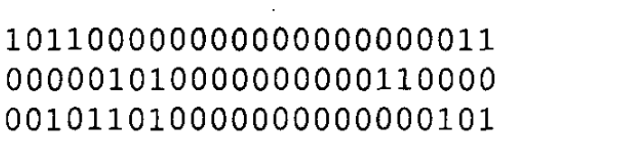
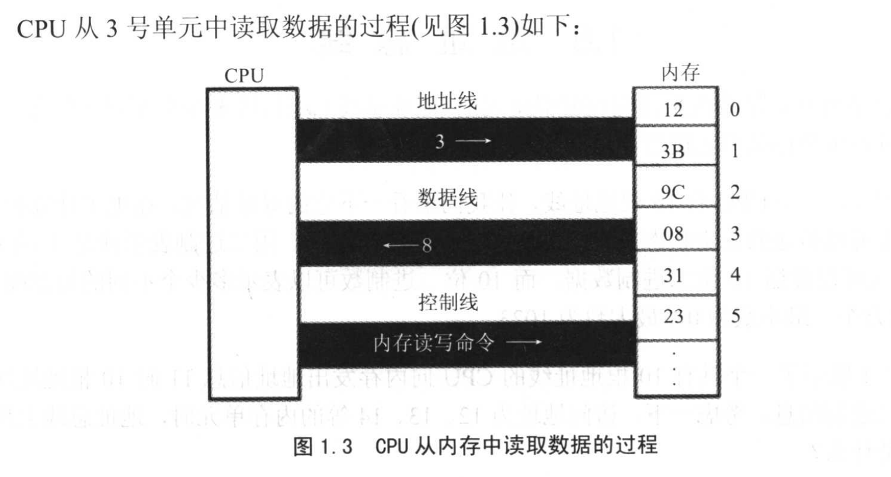
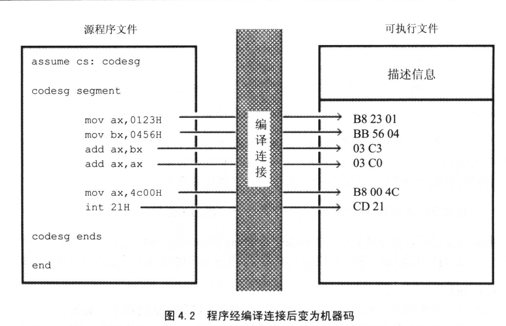
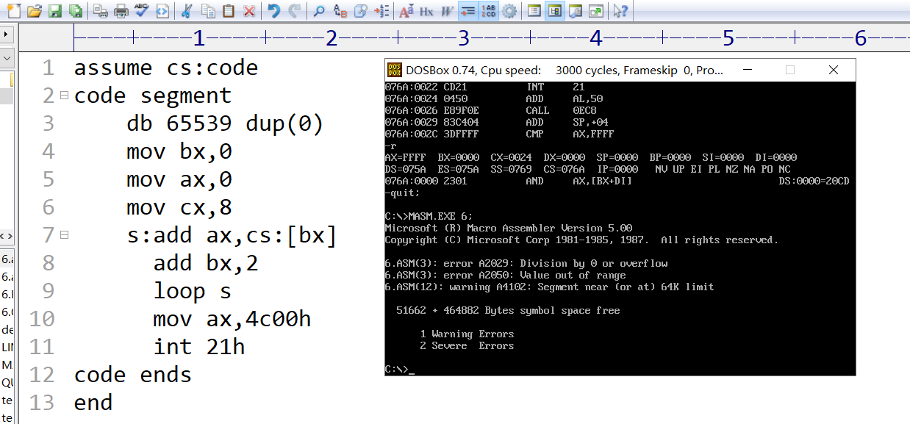
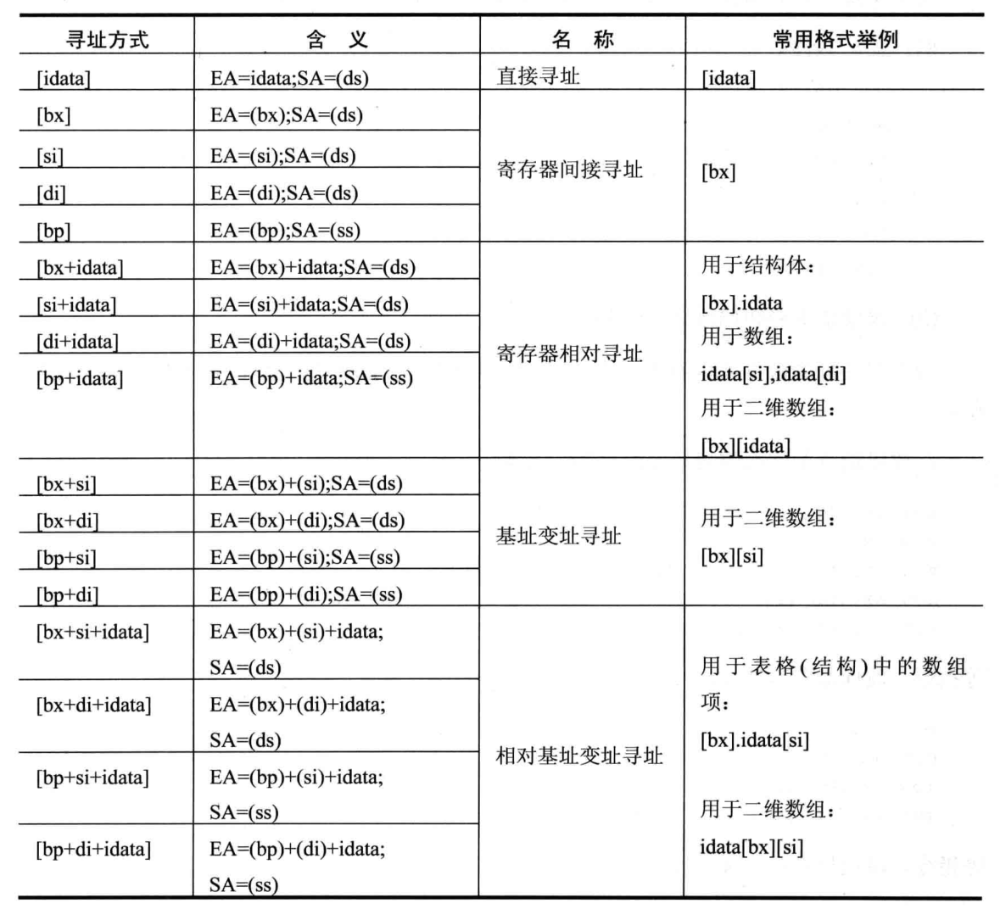

```code
add ax,16 ;默认是10进制
dw 16     ;默认是10进制
```
## 汇编语言王爽
### 前言
- 汇编语言是各种CPU所提供的机器指令的助记符号集合.可以用汇编语言直接控制硬件系统进行工作.汇编语言是很多课程的基础.
汇编是人和计算机沟通的最直接方式.它描述了机器最终所要执行的指令序列.学习汇编可以:充分获得底层编程体验,深刻理解机器运行的
原理,举例来说在学习操作系统时,对很多问题都会有深刻的理解.
- 本书采用8086CPU.
- 书的特点:
  1. 不讲解每一条指令的功能.
  2. 编程的平台是硬件而不是操作系统.只有直接对硬件编程,才能体会到操作系统的作用.
  3. 着重讲解重要的指令和关键概念.jmp 条件转移指令 call int
 ### 基础知识
 - 汇编语言是直接在硬件之上工作的语言,微机原理与接口(关于PC及CPU物理结构和编程结构的研究),计算机组成
 (对计算机一般的结构功能,性能的研究).汇编课程是研究如何利用硬件系统和编程结构和指令集有效灵活地控制系统
 进行工作.
 #### 1.1 机器语言
 - 机器语言是机器指令的集合.机器指令展开来讲就是一台机器可以正确执行的.机器指令是一列二进制数字,计算机
 将之转成高低电平,以使计算机的电子器件受到驱动,进行运算.
 - 早期计算机指的是可以执行机器指令,运行运算的机器.现在由PC中的一个芯片(CPU)完成,CPU是一种微处理器.我们
 提到的计算机由CPU和其它受CPU直接或间接控制的芯片,器件,设备组成的计算机系统.
 - 每一种微机处理器,由于硬件设计和内部结构不同,需要用不同的电平脉冲来控制.每一种微处理器都有自己的机器指令,
即机器语言.
- 早期程序员写0,1数字编成的程序代码打在纸带上或卡片上,再将程序通过纸带机或者卡片机输入计算机,进行运算.
用8086CPU完成运算s=768+12288-1280机器码如下.

- 这样的机器码非常的难记和排查错误.
#### 1.2 汇编语言的产生
- 由于机器语言的问题,产生了汇编语言,汇编语言和机器语言的差别在于指令的表示上.汇编
指令是机器指令便于记忆书写的格式.
- 此后,程序员写的是汇编,可是机算机只能读懂机器指令.需要有一个将汇编指令转成
机器指令的翻译程序,这个就是编译器.
- 汇编指令->编译器->机器码 ->计算机
#### 1.3 汇编语言的组成
1. 汇编指令,机器码的助记符,有对应的机器码.
2. 伪指令,没有对应的机器码,由编译器执行,计算机并不执行.
3. 其他符号:如+ - * /,由编译器识别,没有对应的机器码.???
#### 1.4 存储器
- CPU运行的指令和数据放在存储器中,就是内存.要灵活的利用汇编语言,
就要了解CPU是如何从内存中读取信息,以及向内存中写入信息.
#### 1.5 指令和数据
- 指令和数据都是二进制的东西.
#### 1.6 存储单元
- 1 byte(字节)=8 bit(比特)
#### 1.7 CPU对存储器的读写
- 存储器被分为许多个存储单元.存储单元从0开始顺序编号.编号可以看作
存储单元在存储器中的地址.
- CPU从内存中读数据,首先要指定存储单元的地址,在一台微机中,有很多种器件,
CPU在读写数据的时候,还要指明是对哪一个器件进行操作,进行那种(读写)操作.
- CPU要想进数据读写,必须和外部器件(芯片)进行3类信息的将互.
  1. 存储单元的地址(地址信息)
  2. 器件的选择(控制信息)
  3. 读或写的数据(数据信息)
- 计算机能处理和传输的信息都是信号,电信号要通过导线传送.在计算机中专门有连接CPU和其他芯片的导线,
通常总称为总线,总线从物理上来讲,就是一根根导线的集合.根据传送信息的不同,总线从逻辑上又分为3类,
即地址总线,控制总线,数据总线.

  1. CPU通过地址总线将地址信息3发出.
  2. CPU通过控制线发出内存的读命令,选中存储器芯片,并通知它,将要从中读取数据.
  3. 存储器3号单元中的数据通过数据总线送入CPU.
- 如何让一个计算机或微机处理器工作? 要让一个计算机或微处理器工作,应向它输入能够驱动它进行
工作的电平信息(机器码)
 #### 1.8 地址总线
 - CPU是通过地址总线来指定存储器存地址的.地址总线上能传送多少个不同的信息,CPU就可以对多少个
 存储单元进行寻址.
 - 一个CPU有N根地址线,则可以说这个CPU的地址总线的宽度为N.这样CPU寻多可以寻2^N次方个内存单元.
 #### 1.9 数据总线
 - CPU与内存或其他器件之间的数据传送是通过数据总线来进行的.数据总线的宽度决定了CPU和外界数据传递的速度.
一次不够可以分多次传递.
#### 1.10 控制总线
- CPU对外部器件的控制是通过控制总线来进行的.控制总线的宽度决定了CPU对外部器件的控制力.
- 每个CPU芯都有许多管脚,这些管脚和总线相连.一个CPU可以引出三种总线的宽度标志了这个CPU不
同方面的性能.
#### 1.11 内存空间地址
- 一个CPU的地址线宽度为10,那么可以寻址1024个内存单元,这1024个可寻到的内存单元就构成这个CPU
的内存地址空间.
#### 1.12 主板
- 在每台PC机中,都有一个主板,主板上有核心器件和一些主要器件.这些器件通过总线相连.这些器件有
CPU,存储器,外围芯片组,扩展插槽等.
#### 1.13 接口卡
- 计算机系统中,所有可用程序控制其工作的设备,必须受到CPU的控制.CPU对外部设备不能直接控制,
如显示器,音箱.直接控制这些设备进行工作的是插在扩展插槽上的接口卡.扩展插槽通过总线与CPU相连.
简单的说,就是CPU间接控制外部设备工作.
#### 1.14 各类存储器芯片
- RAM,ROM
#### 1.15 内存地址空间
- 物理上是独立的器件
  1. 都和CPU的总线相连
  2. CPU对它们进行读写的时候都通过控制线发出内存读写的命令
- CPU在操作它们的时候,都把他们当做内存对待.
### 第二章 寄存器(CPU工作原理)
- 一个典型的CPU由运算器,控制器,寄存器等器件构成
####
- 不同的CPU寄存器的个数,结构是不相同的.8086CPU有14个寄存器,每个寄存器有一个名称.这些寄存器是
AX
BX  (DI,SI)
CX
DX
SI
DI

SP  
BP
IP
CS  (CS IP)
SS  (SS SP)
DS  (DS BX)
ES   ---四个sreg 称为段寄存器,其它的是reg
PSW
#### 2.1通用寄存器
- 8086CPU 的所有寄存器是16位,可以存放两个字节,AX,BX,CX,DX这4个寄存器通常用来存放一般性数据,被称为通用
寄存器
- 8086CPU的上一代CPU的寄存器都是8位,为了保证兼容,使原来基于上代CPU编写的程序稍加修改就可以运行在8086CPU上,
8086CPU的
```code
AX可分为AH,AL(AL的低8位构成了AL寄存器高8位构成了AH寄存器,AH和AL寄存器是可以独立使用的8位寄存器)
BX可分为BH,BL
CX可分为CH,CL
DX可分为DH,DL
```
这四个寄存器都可以分为两个可独立使用的8位寄存器来用.

#### 2.10 CS和IP
- CS和IP是8086CPU中两个最关键的寄存器,它们指示了CPU当前要读取指令的地址,CS为代码段寄存器,
IP为指令指针寄存器.
 1. Instruction pointer register(IP,指令指针寄存器)
 2.  code segment (CS,代码段寄存器)
-  8086CPU的工作过程可以简要描述如下:
  1. 从CS:IP指向内存单元读取指令,读取的指令进入指令缓冲器.
  2. IP=IP+所读取指令的长度,从而指向下一条指令.(先加再执行,因为执行可能改变CS,IP的值)
  3. 执行指令.转到步骤1,重复这个过程
- 在8086CPU加电启动或复位后(即CPU刚开始工作时)CS和IP被设置为CS=F000H,IP=FFFFH,即
在8086CPU机刚启动时,CPU从内存FFFF0H单元中读取指令执行,FFFF0H单元中的指令是
8086PC机开机后执行的第一个指令.
- CS和IP很重要,它们的内容提供了CPU要执行指令的地址.
- 我们在第一章中讲过,在内存中,指令和数据没有任何区别,都是二进  
#### 2.11 修改CS,IP的指令
- 在CPU中,程序员能够用指令读写的部件中有寄存器,程序员可以通过改变寄存器中的内容,
实现对CPU的控制.CPU从何处执行指令是由CS,IP中的内容决定的,程序员可以通过改变CS,IP中的
内容来控制CPU执行目标指令.
- 大部分寄存器的值,都可以用mov指令来改变,mov指令被称为传送指令.mov不能用于设置
IP,CS的值,是因为8086CPI没有提供这样的功能.8086CPU为CS,IP提供了另外的指令来改变它们的
值.能够改变CS,IP的内容的指令被称为转移指令.现在我们介绍一个最简单的可以修改CS,IP的
指令:jmp
- 如果想同时修改CS IP的内容,可用指令 jmp段地址:偏移地址 完成
- 若想仅修改IP的内容,可用指令 jmp 某一合法寄存器 完成
``` code
jmp ax // jmp 某一合法寄存器 的功能为:用寄存器中的值修改IP
       // jmp ax,在含义上类似于 mov IP,ax这样的指令.
```
#### 2.12代码段
- 在编程时,可以根据需要,将一组内存单元定义为一个段.可以将长度为N(n<=64Kb)的一组代码,存在一组连续,起始
地址为16的倍数的内存单元中.
- 如何使得代码段中的指令被执行呢?将一段内存当作代码段,仅仅是我们在编程时的一种
安排,CPU并不会由于这种安排,就自动将我们定义的代码段中的指令当作指令来执行.
- 2.9~2.12
  1. 段地址在8086CPU中的段寄存器中存放.当8086CPU要访问内存时,由段寄存器提供内存单元的段
地址.8086CPU有4个段寄存器,CS是用来存储指令的段地址.

- 实验1,查看CPU和内存,用机器指令和汇编指令编程
  1.debug:debug是dos,windows提供的实时模式程序的高度工具.使用它,可以查看CPU
  各种寄存器中的内容,内存的情况和在机器码级跟踪程序的运行.
  2.用到的debug的功能
    1. R命令查看,改变CPU寄存器的内容
    2. D命令查看内存的内容
    3. E命令改写内存中的内容
    4. U    将内存中的机器指令翻译成汇编指令(如何查看写入或内存中原有的机器码对应的汇编指令,u 段地址:偏移地址
        查看从 对应物理地址的内存单元中的机器指令和它们所对应的汇编指令)
    5. T    执行一条机器指令 (P执行 int 21) 
    6. A    以汇编指令的格式在内存中写入一条机器指令.
#### Debug
- Debug是DOS,Windows提供的8086程序调试工具.使用它,可以查看CPU各种寄存器中的内容,内存的情况
和机器码级别跟踪程序的运行.
- 我们用到的Debug功能
  1. 用Debug的R命令查看,改变CPU寄存器的内容
  2. 用Debug的D命令查看内存的内容.
### 第3章 寄存器(内存访问)
- 第2章中,我们主要从CPU如何执行指令的角度讲解了8086CPU的逻辑结构,形成物理地址的方法,
相关的寄存器以及一些指令.这一章,访问内存的角度继续学习.
#### 3.2 DS和 address
- CPU要读写内存单元的时候,必须先给出这个内存单元的地址.在8086PC中,内存地址由段地址和偏移
地址组成.8086CPU中有一个DS寄存器,通常用来存放要访问数据的段地址.比如我们要读取1000H单元的
内容:
```code
mov bx,1000H
mov ds,bx
mov al,[0]  //mov 1.可将数据送往寄存器 2.将一个寄存器的内容送入另一个寄存器 3 将内存单元
送往一个寄存器中. [..]表示内存单元,ds中的数据为内存单元的段地址 [..]中的数为内存的偏移地址.
```  
- 将数据送入寄存器可以用``MOV AX,1``,不能用这样的方式将数据直接送入段寄存器,
只能通过寄存器中转,这是8086CPU硬件设计问题.
#### 3.5 数据段
- 对于8086机,在编程时,我们可以根据需要将一组内存定义为一个段,我们可以将一组长度有N(N,=64K),
地址连续的,起始地址为16的倍数的内存单元当作专门存储数据的内存空间.
- 如何访问数据段中的数据呢? 将一段内存当作数据段,是我们在编程时的一种安排,我们可以在具体
操作的时候,用ds存放数据段的段地址,再根据需要,用相关指令访问数据段中的具体单元.
#### 3.6 栈
- 先进后出
#### 3.7 CPU提供栈机制
- 现今的CPU中都有栈的设计,8086CPU也不例外.8086CPU提供相关的指令来以栈的方式
访问内存空间,这意味着,我们在基于8086CPU编程的时候,可以将一段内存当作栈来使用.
- 8086CPU提供入栈和出栈指令.PUSH,POP,``push ax``,``pop ax``,8086CPU的入栈和
出栈操作都是以字为单位进行的.
- push ax的执行,由以下两步完成.
 1. sp=sp-2 ss:sp指向当前栈顶前面的单元,以当前栈顶前面的单元为新的栈顶
 2. 将ax中的内容送入ss:sp指向的内存单元处,ss:sp指向的内存单元处,ss:sp此时指向新栈顶.
- pop ax的执行过程和Push ax刚好相反
  1. 将SS:SP指向内存单元的数据送入AX中
  2. sp=sp+2,SS:SP指向当前栈顶下面的单元,以当前栈顶下面的单元为新的栈顶. 
- CPU如何知道当前要执行的指令的位置,CS,IP中存放这当前指令的段地址和偏移地址.
CPU如何知道栈顶位置?显然,也应该有相应的寄存器来存放栈顶的地址,8086CPU中,有两个
寄存器,段寄存器SS( Segment Selector Register)和寄存器SP,栈顶的段地址放在SS中,偏移
地址存放在SP中,任意时刻,SS:SP指向栈顶元素.push指令和pop指令执行时,CPU从SS和SP中得到
栈顶的地址.
#### 3.8 栈顶超界的问题
- 栈顶超界是危险的,8086CPU不保证我们对栈的操作不会超界.
#### 3.9 push,pop指令
- push和pop指令是可以在寄存器和内存(栈)之间传递数据.
```code
push 寄存器;将一个寄存器中的数据入栈.
push 段寄存器;将一个寄存器中的数据入栈.
//push和pop也可以在内存单元和内存单元之间传递数据
push 内存单元; 将一个内存字单元处的字入栈.
```
- 指令执行时,CPU要知道内存单元的地址,可以在push,pop指令中只给出内存单元偏移
地址,段地址在指令执行时,CPU从ds中取得.
### 第4章 第一个程序
- 编写一个完整的程序,用编译器编译成可执行文件(如.exe),在操作系统中运行.
#### 4.1 一个源程序从写出到执行的过程
- 描述一个汇编语言程序从写出到最终执行的简要过程
  1. 编写汇编源程序
  2. 使用汇编语言编译程序对源程序文件中的源程序进行编译,产生目标文件,再用``连接程序对目标文件进行连接``
 生成可在操作系统中直接运行的可执行文件.
  3. 执行可执行文件中的程序.
  - 可执行文件包含两部分
    1. 程序(从源程序中的汇编指令翻译过来的机器码)和数据(源程序中定义的数据)\
    2. 相关的描述信息(比如,程序有多大,要占用多个内存空间等)
- 操作系统依照可执行文件中的描述信息,将可执行文件中的机器码和数据加载入内存.并进行相关的
初始化(比如设置CS:IP指向第一条要执行的指令),然后由CPU执行程序.    
- 使用汇编语言编译程序对源程序文件中
#### 4.2 源程序
```code
assume cs:codesg
codesg segment
start : mov ax,0123H
        mov bx,0456H
        ADD AX,BX
        ADD AX,AX
        MOV AX,4C00H
        INT 21H
CODESG ENDS
END

伪指令  segment ends是一对成对使用的伪指令,定义一个段,一个是开始,一个是结束,要有一个名称来标识.
一个汇编是由多个段组成的,用来存放代码,数据或当作栈空间来使用.一个源程序中所有将被计算机处理的
信息:指令 数据 栈被划分到了不同的段中.
codesg segment
codesg ends

end 是一个汇编程序的结束标记.

assume 含义是假设.它假设某一段寄存器和程序中的某一个用segment...ends定义的段相关联.
通过assume说明这种关联.用assume cs:codesg 将用作代码段的段codesg和CPU中的段寄存器cs联系起来.

```
1 伪指令
  - 在汇编语言源程序中,包含两种指令,一种是汇编指令,一种是伪指令.汇编指令是有对应机器码的指令,可以被
编译为机器指令,最终被CPU执行,而伪指令没有对应的机器指令,最终不被CPU所执行.伪指令是由编译器执行的
2 源程序中的程序
  - 用汇编语言写的源程序,包括伪指令和汇编指令,我们编程的最终目的是让计算机完成一定的任务.
我们这里说的程序就是指源程序中最终由计算机执行处理的指令或数据.

3 标号
  - 标号,如codesg,一个标号指代一个地址,是一个段名称,最终被编译连接处理为一个段的段地址.
4 程序的结构
  - 源程序是由段构成的,我们可以在段中放代码,数据,或将某个段当做栈空间.我们现在来一步步完成
一个小程序.
```code
// task 编程运算2^3
1 定义一个段,名称为abc
2 写入汇编指令,来实现我们的处理任务
3 指出程序在何处结束
4 将abc和cs联系起来(不是非这样做)
5 程序返回 程序先以汇编指令的形式存在源程序中,经编译,连接后转变为机器码,存在可执行文件中.
在DOS(一个单任务操作系统的基础上),P2在可执行文件中,必须有一个正在运行的程序P1,将P2从可执行文件中加载入内存,
将CPU的控制权交给p2,p2才能得以运行.p2开始运行后,P1暂停运行.当P2运行完毕后,应该将CPU的控制权交还给使它得以运行的程序P1,此后,
P1继续运行.CPU控制权的交还叫做程序返回.应该在程序的末尾添加返回的程序段.
如: mov ax,4c00H
    int 21H
    这两条指令所实现的功能就是程序返回.
abc segmnet
mov ax,2
add ax,ax
add ax,ax
abc ends
end
```

|目的|相关指令|指令性质|指令执行者|
|---|---|---|---|
|段结束||||
|程序结束||||
|程序返回||||

6 语法错误和逻辑错误
-  编译器发现的是语法错误.
#### 4.4 编译
- 编写 .asm的文件,编译,生成包含机器代码的目标文件.用微软的masm 汇编编译器,文件名为masm.exe
#### 4.5连接
- 连接的作用
  1. 当源程序很大时,可以将它分为多个源程序文件来编译,每个源程序编译成为目标文件后,再用连接程序将它们连接
  到一起,生成一个可执行文件.
  2. 程序中调用了某个库文件中的子程序,需要将这个库文件和该程序生成的目标文件连接到一起.
  3. 一个源文件编译后,得到了存有机器码的目标文件,目标文件中的有些内容还不能直接用来生成可执行文件.
 连接程序将这些内容处理为最终的可执行信息.所以,在只有一个源程序文件,不需要调用某个库的子程序的情况下,
 也必须用连接程序对目标文件进行处理,生成可执行文件.
 ```code
 masm 文件名
 link 文件名
 ```
 ### 第5章 [bx]和LOOP指令
 - [bx]和内存单元描述,[bx]和[0]有些类似.[0]表示内存单元,它的偏移地址是0
 ```code
 mov ax,[0] //将一个内存单元的内容送入ax,内存单元的长度为2字节(字),偏移地址为0,段地址在ds中
 mov a1,[0] //将一个内存单元的内容送入a1,内存单元的长度为1字节(字节单元),偏移地址为0,段地址在ds中
 //描述一个内存单元,需要两种信息 1 内存单元的地址 2内存单元的长度
 [bx] 同样也表示一个内存单元,它的偏移地址在bx中,比如下面的指令:
 mov ax,[bx] 将一个内存单元的内容送入ax,这个内存单元的长度为2个字节(字),偏移地址在bx中,段地址在ds中.
 ```
 - loop 循环,和指令的循环有关
 - ()是定义的描述性符号,表壳一个寄存器或一个内存单元中的内容.(ax)表示ax中的内容,(al)表示al中的内容.
 (20000H)表示内存单元为20000单元的内容()中的内存单元的地址为物理地址.
 #### 5.2 LOOP指令
 - Loop指令的格式是: loop标号
   1. (cx)= (cx)-1
   2. 判断cx中的值,不为零则转至标号处执行程序,如果为零则向下执行.
 ```code
 //计算2^12
 assume cs:code
 code segment
 mov ax,2
 add ax,ax
 add ax,ax
 .
 .
 .再做9次
 code ends
 end
```  
```code
 assume cs:code
 code segment
 mov ax,2
 mov cx,11
 s: add ax,ax #标号,在汇编语言中,标号代表一个地址,s,标识了一个地址.这个地址处有一个指令 add ax,ax.
    loop s  # loos s  cpu进行两步操作  1 (cx)=(cx)-1  2 判断 cx中的值,不为0转至标号s的地址,如果为0
    则执行下一条指令(下一条指令是 mov ax,4c00H)
    mov ax,4c00h
    int 21h
 code ends
 end
```
#### 5.3 在debug中跟踪用loop指令实现的循环程序
### 第6章 包含多个段的程序
- 前面的程序中,只有一个代码段.
- 在操作系统的环境中,合法地通过操作系统取得的空间都是安全的,因为操作系统不会让一个程序所用的空间和其他程序以及
系统自己的空间相冲突.在操作系统允许的情况下,程序可以取得任意容量的空间.
- 程序取得所需空间的方法有两种,1 在加载程序的时候为程序分配 ,2 在程序执行过程中向系统申请.
- 加载程序的时候为程序分配空间,我们在前面已经有所体验,比如我们的程序在加载的时候,取得了代码段中的存储空间.
- 我们若要一个程序在被加载的时候取得所需的空间,则必须要在源程序中做出说明.我们通过在源程序中定义段来进行内存
空间的获取.
#### 6.1 在代码段中使用数据
- 前面的课程中,是累加某些内存单元中的数据,不关注数据本身.如果要累加给定数值的数据.可以将它们一个个加载到
ax寄存器中,如果希望可以用循环的方法进得累加,在累加前,要将这些数据存储在一组地址连续的内存单元中,可以用指令一个个
将它们送入地址连续的存储单元中.
- 从规范的角度来讲,我们不能自己随便决定哪段空间可以使用.应该让系统来为我们分配.我们可以在程序中,定义我们希望
处理的数据,这些数据就会被编译,连接程序作为程序的一部分写到可执行文件中.当可执行文件中的程序被加载到内存时,
这些数据也同时被加载入内存中.与此同时,我们要处理的处理也就自然而然的获取了存储空间.
```code
assume cs:code
code segment
    //dw(define word) 定义字型数据,使用dw定义了8个字型数据.(数据之间以逗号分隔),它们所占的内存空间为16个字节.
    dw 0123h,0456h,0789h,0abch,0defh,0fedh,0987h 
    mov bx,0  //偏移地址设为0
    mov ax,0  //累加器设为0
    mov cx,8  //累加次数设为8
    s:add ax,cs:[bx]
      add bx,2
      loop s
      
      mov ax,4c00h
      int 21h
code ends
end
 用u查看指令.没有看到程序中的指令.其实看到的也是程序中的内容,只不过不是源程序中的汇编指令所对应的机器码.
 而是源程序中,在汇编指令前,用dw定义的数据.实际上,在程序中,有一个段码段,在代码段中,前面的16个字节是用dw定义 
 的数据,从第16个字节才是汇编指令的对应的机器码.
 用u [cs]:0010
 - 如何执行程序中的指令? 用debug加载后,可以将IP设置为10h,从而使CS:IP指向程序中的第一条指令.然后再用t,p,g命令执行
 可是这样一来,就必须用Debug来执行程序.上面的例子编译,连接成可执行文件后,在系统中直接运行可能会出现问题,
 因为程序的入口不是我们所希望执行的指令.如何让这个程序在编译,连接后可以在系统中直接运行呢?我们可以在源程序中
 指明程序的入口所在.
 assume cs:code
 code segment
     //dw(define word) 定义字型数据,使用dw定义了8个字型数据.(数据之间以逗号分隔),它们所占的内存空间为16个字节.
     dw 0123h,0456h,0789h,0abch,0defh,0fedh,0987h 
     start:mov bx,0  //偏移地址设为0
           mov ax,0  //累加器设为0
           mov cx,8  //累加次数设为8
         s:add ax,cs:[bx]
           add bx,2
           loop s
       
         mov ax,4c00h
         int 21h
    code ends
 end start
 注意,在程序中加入的新内容,在程序的第一条指令的前面加上了一个标号start,而这个标号在伪指令end的后面出现.
 end除了通知编译器程序结束处,还可以通知编译器程序的入口在什么地方.在上面的例子中,我们用end指令说明了程序的
 入口在start处,也就是说 mov bx,0 是程序的第一条指令
```
  
- 在前面的课程中,我们已经知道在单任务系统中,可执行文件中的程序执行过程如下.
  1. 由其他的程序(Debug,command或其他程序)将可执行文件中的程序加载入内存.
  2. 设置CS:IP指向程序的第一条要执行的指令(即程序的入口),从而使程序得以运行;
  3. 程序运行结束,返回到加载者
  根据什么设置CPU的CS:IP指向程序的第一条要执行的指令?这一点,是由可执行文件中的描述信息指明的.我们知道可
  执行文件由描述信息和程序组成,程序来源于源程序中的汇编指令和定义数据.描述信息则主要是编译,连接程序对源程序
  中相关伪指令进行处理得到的信息.我们在上面的程序中,用伪指令end描述了程序的结束和程序的入口.在编译,连接后
  由end start指明的程序入口,被转化为一个入口地址,存储在可执行文件的描述信息中.当程序被加载入内存后,加载者
  从程序的可执行文件的描述信息中读到程序的入口地址,设置CS:IP,这样CPU就从我们希望的地址处开始执行.
- 我们若要CPU从何处开始执行程序,只要在源程序中用 end标号 指明就可以了.
####  6.2 在代码段中使用栈(SS:SP 指向栈顶元素)
- 利用栈,将程序中定义的数据逆序存放.
- 程序运行时,定义的数据存放在cs:0~cs:F单元中,共8个字单元.依次将这8个字单元中的数据入栈,然后再依次出栈到8个
字单元中,从而实现数据的逆序存放.
- 要一段可以当作栈的内存空间,段空间应该由系统来分配,我们可以在程序中通过定义数据来取得一段空间,然后将这段
空间当作栈空间来用.
```code
assume cs:codesg
codesg segment
   dw 0123h,0456h.........
   dw 0,0,0  #用dw定义16个字型数据,在程序加载后,将取得16个字的内存空间.
   start : mov ax,cs
           mov ss,ax  ;cs不能直接赋值给ss
           mov sp,30h #将设置栈顶ss:sp指向cs:30
           
           mov bx,0
           mov cx,8
         s:push cs:[bx]
           add bx,2
           loop s #以上代码将0~15单元中的8个字型数据依次入栈
           
           mov bx,0
           mov cx,8
        s0:pop cs:[bx]
           add bx,2
           loop  s0  #以上依次出栈8
           
           mov ax,4c00h
           int 21h   
        codesg ends
        end start  #指明程序的入口在start处
        我们要将cs:10~cs:2F的空间当作栈来用,初始状态下栈为空,所以ss:sp要指向栈底.则设置ss:sp指向cs:30         
```
- 在代码段中定义了16个字型数据,它们的数值都是0.这16个字型数据的值是多少,对程序来说是没有意义的,我们用dw定义16个数据,
即在程序中写入了16个字型数据.在程序在加载后,用32个字节的内存来存放它们.空间是我们要的,程序把它当作栈空间.我们的最终
目的是通过它们取得一定容量的内存空间.所以我们在描述dw的作用的时,可以说用它定义数据,也可以说用它开辟内存空间.
#### 6.3 将数据,代码,栈放入不同的段
- 在前面的内容中,我们将程序中用到的数据,栈和代码都放到了一个段里面.
  1. 这样显得程序混乱
  2. 前面程序中处理的数据很少,用到的栈空间也小,加上没有多长的代码,放到一个段里面没有问题.如果数据,栈和代码需要的空间
超过64KB,就不能放在一个段中.(一个段的容量不能大于64KB,这是8086模式的限制,并不是所有的处理器都这样)
- 所以,应该考虑用多个段来存放数据,代码和栈.
```code
用和定义代码段一样的方法来定义多个段,然后在这些段里面定义需要的数据,或通过定义数据来取得栈空间.
assume cs:code,ds:data,ss:stack
data segment
     dw 0123h...........
data ends
stack segment
     dw 0,.........
stack ends
code segment
start: mov ax,stack
       mov ss,ax
       mov sp,20 #设置栈顶ss:sp指向stack:20
       mov ax,data
       mov ds,ax #ds指向data段
       mov bx,0 ..ds:bx指向data段中的一个单元.
       mov cx,8
     s:push [bx]
       add bx,2
       loop s   //以上将data段中的0~15单元中的8个字型数据依次入栈
       
       mov bx,0
       mov cx,8 
    s0:pop [bx]
       add bx,2
       loop s0 #以上依次出栈8个字型的数据到data的0~15单元中.
    code ends
    end start   
              
 指令mov ds,data中的data将被编译器处理为一个表示地址的数值    
 
 assume cs:code,ds:data,ss:stack  cpu不会将cs指向code ,ds指向data,ss指向stack
 assume是伪指令,由编译器执行的.也是仅在源程序中的信息,CPU也不知道,不深究assume的作用,
 只要知道需要用它将定义的具有一定用途的段和相关的寄存器联系起来就可以了.     
```


- 程序中的指令要对这8个数进行累加,可是这8个数据在那?由于它们在代码段中,程序在运行的时候cs中存放代码段的
段地址,所以可以从cs中得到它们的段地址.偏移地址是多少呢?因为用dw定义的数据处于代码段的最开始.所以偏移地址为0,
这8个数据在代码段的偏移为1,2,4,6,8....程序运行是,它们的地址就是CS:0,CS:2.....
- 程序中用bx存放加2递增的偏移地址,用循环来进行累加.在循环开始前,设置(bx)=0,cs:bx指向第一个数据所在的子单元.
每次循环中(bx)=(bx)+2,cs:bx指向下一个数据所在的字单元.
#### 实验5


### 第7章 更灵活的定位内存地址的方法
- 前面,我们用[0],[bx]的方法,在访问内存的指令中,定位内存单元的地址.本章我们主要通过具体的
问题来讲解一些更灵活的定位内存地址的方法和相关的编程方法.
- 7.1 and和or指令
- 首先,介绍两条指令 and或or,因为我们下面的例子要用到
```code
1 and指令:逻辑与指令,按位进行与运算
mov a1,01100011B
and a1,00111011B
执行后: a1=0010011B,通过该指令可将操作对象的相应位设为0,其他位不变.
2 or指令:逻辑或指令,按位进行或运算
mov a1,01100011B
or  al,00111011B
执行后:a1=01111011B,通过该指令可将操作对象的相应位设为1,其他位不变
```
#### 7.3 以字符形式给出的数据
- 我们可以在汇编程序中,用 ‘’的方式指明数据是以字符的形式给出的,编译器将把它们转化为相对应的
ASCII码.
```
 db 'unIX' ; 相当于 db 75H,6EH,49H,58H
```
#### 7.5 [bx+idata]
- 在前面用[bx]的方式来指明一个内存单元,还可以用一种更为灵活的方式来指明内存单元:[bx+idata]
```code
mov ax,[200+bx]
mov ax,200[bx]
mov ax,[bx].200
```
#### 7.6 用[bx+idata]的方式进行数组的处理
- 有了[bx+idata]这种表示内存单元的方式,我们就可以用更高级的结构来看待所要处理的数据.
```code
在codesg中写代码,将datasg中定义的第一个字符串转化为大写,第二个字符串转成小写.
assume  cs:codesg,ds:datasg
datasg segment
 db 'BaSiC'
 db 'MinIx'
datasg ends
codesg segment
   start:
codesg ends
end start

原来的方法,用[bx]的方式定位字符串的字符,代码段中的程序如下.
    mov ax,datasg
    mov ds,ax
    mov bx,0
    mov cx,5
  S:mov a1,[bx]
    and a1,110111111b
    mov [bx],a1
    inc bx
    loop s
    
    mov bx,5
    mov cx,5
 s0:mov a1,[bx]
    or a1,00100000b
    mov [bx],a1
    inc bx
    loop s0
- 现在有了[bx+idata的方式],就可以用更简化的方法来完成上面的程序.datasg段的两个字符串,一个的起始
地址为0,一个起始地址为5.可以用[0+bx],[5+bx]的方式在同一个循环中定位这两个字符串中的字符.
    mov ax,datasg
    mov ds,ax
    mov bx,0
 S: mov a1,[0+bx]  #0[bx]
    mov [0+bx],a1
    and a1,00100000b
    mov a1,[5+bx]
    or a1,110111111b
    mov [5+bx],a1
    inc bx
    loop s
  如果用高级语言,比如c语言来描述上面的程序
  char a[5]="BASIC"
  char b[5]="MInIx"
  main(){
  int i;
  i=0;
  do{
     a[i]=a[i]&0xDF;
     b[i]=b[i]|0x20
     i++;
  }while(i<5);
  }  
  
  它们定位字符串中字符的方式
  c语言: a[i],b[i]
  汇编语言:0[bx],5[bx]
  通过比较,我们可以发现,[bx+idata]的方式为高级语言和数组提供了便利机制.
```
#### 7.7 SI和DI
- SI和DI是8086CPU中和bx功能相近的寄存器,si和di不能分成两个8位寄存器来使用.下面的3组指令实现了相同的功能
```code
mov bx,0
mov ax,[bx]  #mov ax,[bx+123]

mov si,0
mov ax,[si]  #mov ax,[si+123]

mov di,0
mov ax,[di]  #mov ax,[di+123]
```
#### 7.8 [bx+si]和[bx+di]
- 在前面用[bx(si或di)]和[bx(si或di)+idata]的方式来指明一个内存单元,我们还可以用更灵活的方式:
[bx+si]和[bx+di]
```code
mov ax,[bx+si]
将一个内存单元的内容送入ax,这个内存单元的长度为2字节(字单元),存放一个字,偏移地址为bx的数值加上
si中的数值,段地址在ds中.
```
#### 7.9 [bx+si+idata]和[bx+di+idata]
```code
[bx+si+idata]和[bx+di+idata]含义相似
[bx+si+idata]表示一个内存单元,它的偏移地址为bx+si+idata(即bx中的数值加上si中的数值再加上idata)
mov ax,[bx+si+idata]的含义如下
将一个内存单元的内容送入ax,这个内存单元的长度为2字节(字单元),存放一个字,偏移地址为bx的数值加上
si中的数值再加上idata,段地址在ds中.
```
#### 7.10 不同的寻址方式的灵活应用.
- 如果我们比较一下前面用到的几种定位内存地址的方法(可称为寻址方式),就可以发现:
```
1. [idata]用一个常量表示地址,可以用变量直接定位一个内存单元
2. [bx]用一个变量来表示内存地址,可用变量间接定位一个内存单元
3. [bx+idata]用一个变量和常量表示地址,可在一个起始地址的基础上用变量间接定位一个内存单元
4. [bx+si]有两个变量表示地址
5. [bx+si+idata]用两个变量和一个常量表示地址
可以看到,从[idata]一直到[bx+si+idata],我们可以用更加灵活的方式来定位一个内存单元的地址.这使我们
可以从更加结构化的角度来看待所要处理的数据.
```
```code
两层循环用cx会出错
1. 用寄存器会有个数限制
2. 用内存(栈)
```

### 第8章 数据处理的两个基本问题
- 计算机是进行数据处理,运算的机器,那么有两个基本的问题就包含在其中
  1. 处理的数据在什么地方
  2. 要处理的数据有多长
- 在机器指令中,这两个指令必须给以明确或隐含的说明,否则计算机无法工作.虽然讨论是在8086CPU的基础上
进行的,但是这两个基本的问题却是普遍的,对任何一个处理机都存在.
- 我们定义描述性符号 reg和sreg,reg表示一个寄存器,用sreg表示一个段寄存器.
-reg 包括 ax,bx,cx,dx,ah,al,bh,bl,ch,cl,dh,dl,sp,bp,si,di
- sreg包括 ds,ss,cs,es
#### 8.1 bx,si,di和bp
```code
在8086CPU中,只有这4个寄存器可以用在[...]中来进行内存单元的寻址.
mov ax,[bx]
mov ax,[bx+si]
下面的指令是错的
mov ax,[cx]
在 [..]中,这4个寄存器可以单个出现,或只能以4种组合出现
bx si
bx di
bp si
bp di  #测试一下可否调换位置

只要在[...]使用寄存器bp,而指令中没有显性地给出段地址,段地址就默认在ss中
mov ax,[bp]  // (ax)=((ss)*16+(bp))
```
#### 8.2 机器指令处理的数据在什么地方
- 绝大部分机器指令都是进行数据处理的指令.处理大致可以分为3类:读取,写入,运算.在机器指令这一层来讲,
并不关心数据的值是多少,而关心指令执行前一刻,它将处理的数据所在的位置.指令在执行前,所要处理的数据可以
在3个地方:CPU内部,内存,端口.(端口将在后面的课程中进行讨论)

|机器码|汇编指令|指令执行前数据的位置|
|---|---|---|
| |mov bx,[0]|内存ds:0单元|
| |mov bx,ax|CPU内部,ax寄存器|
| |mov bx,1|CPU内部,指令缓冲器|
#### 8.3汇编语言中数据位置的表达
- 在汇编语言中如何表达数据的位置?汇编语言中用3个概念来表达数据的位置
  1. 立即数  对于直接包含在机器指令中的数据(执行前在CPU的指令缓冲器中),在汇编语言中称为:立即数(Idata),在
  汇编指令中直接给出.
  ```code
  mov ax,1
  add bx,2000h
  or bx,00010000b
  mov al,'a'
  ```
  2 寄存器 指令要处理的数据在寄存器中,在汇编指令中给出相应寄存器的名
  ```code
  mov ax,bx
  ```
  3 段地址(SA)和偏移地址(EA)
  指令要处理的数据在内存中,在汇编指令中可用[X]的格式给出EA,SA在某个段寄存器中.
  ```code
  存放段地址的寄存器可以是默认的,比如.
  mov ax,[0] # 段地址默认在ds中
  mov ax,[bp]  #段地址默认在ss中
  mov ax,es:[bx]  #段地址显示给出
  ```
  #### 8.4 寻址方式 
  - 当数据存放在内存中的时候,我们可以用多种方式来给定这个内存单元的偏移地址,这种定位内存单元的方法
  一般被称为寻址方式.
  
  
  #### 8.5 指令要处理的数据有多少
  - 8086CPU的指令,可以处理两种尺寸的数据,byte和word.所以在机器指令中要指明,指令进行的是进行的字操作还是字
  操作.
```code
   1. 通过寄存器名指明要处理的数据的尺寸.
   字操作
   mov ax,1
   mov bx,ds:[0]
   字节操作
   mov a1,1
   mov a1,b1
   2. 在没有寄存器名存在的情况下,用操作符 X pr指明内存单元的长度,x在汇编指令中可以为word或byte
   mov word ptr ds:[0],1
   inc word ptr [bx]
   下面的指令中,用byte ptr指明了指令访问的内存单元是一个字节单元
   mov byte ptr ds:[0],1
   inc byte ptr [bx]
   在没有寄存器参与的内存单元访问指令中,用word ptr或byte ptr显性地指明所要访问的内存单元的长度是很
   有必要的.否则CPU无法得知要访问的单元是字单元,还是字节单元.
   3 其他方法
   有些指令默认了访问的是字单元还是字节单元 如 push[1000H]就不用指明是字单元还是字节单元,因为Push
   指令只进行字操作.
```  
#### 8.6 寻址方式的综合应用
#### 8.7 div指令
- div是除法指令,使用div做除法的时候应注意以下问题
1. 除数,有8位和16位两种,在一个reg或内存单元中
2. 被除数,默认放在ax或dx和ax中,如果除数为8位,被除数为16位放在ax中.如果除数为16位,被除数为32位,
则在dx和ax中存放,dx放在高16位,ax放在低16位.
3. 结果:如果除数为8位,则al存储除法操作的商,AH存储除法操作的余数;如果除数为16位,则ax存储除法操作的商,
dx存储除法操作的余数
#### 8.8 伪指令dd
- db定义字节型数据,dw定义字型数据,dd(double word)双字型数据
```code
data segment
  db 1  ;01H 在data:0处,占1个字节
  dw 1  ;0001H 在data:1处,占1个字
  dd 1  ;00000001H,在data:3处,占2个字
data ends
```
#### 8.9 dub
- dup是一个操作符,在汇编语言中同db,dw,dd等一样.也是由编译器识别处理的符号.它是和db,dw,dd等数据定义的伪指令配合使用,用来进行数据的重复.
```code
db 3 dup (0) ;定义3个字节,它们的值都是0,相当于 db 0,0,0
db 3 dup (0,1,2); 定义了9个字节,它们是0,1,2,0,1,2,0,1,2 相当于
                ; db 0,1,2,0,1,2,0,1,2
//db的使用格式
db 重复次数 dup(重复的数据)
dup是一个十分有用的操作符,比如要定义一个容量为200个字节的栈段,不用dup就会很麻烦.

stack segment
  db 200 dup(0)
stack ends  
                
```
### 第9章 转移指令的原理
- 可以修改IP,或同时修改CS和IP的指令统称为转移指令.转移指令就是可以控制CPU中的代码执行内存中某处代码的指令.
- 8086CPU的转移行为有以下几类
  1. 只修改IP时称为段内转移 比如: jmp ax
  2. 同时修改CS和IP时,称为段间转移,比如: jmp 1000:0
- 由于转移指令对IP的修改范围不同,段转移又分为:短转移和近转移
  1. 短转移的IP的修改范围是-128~127
  2. 近转移的IP的修改范围是-32768~32768
- 8086CPU的转移指令分为以下几类
  1. 无条件的转移指令(如:jmp)
  2. 条件转移指令
  3. 循环指令(如loop)
  4. 过程
  5. 中断
- 这一章通过深入学习无条件转移指令jmp来理解CPU执行转移指令的基本原理.
#### 9.1 操作符offset
```code
//操作符offset 在汇编语言中是由编译器处理的符号,它的功能是取得标号的偏移地址.
assume cs:codesg
codesg segment
  start: mov ax,offset start  ;相当于mov ax,0
     s:  mov ax,offset s      ;相当于mov ax,3
codesg ends
end start
在上面的程序中,offset操作符取得了标号start和s的偏移地址0和3

//将s处的指令复制到s0处
assume cs:codesg
codesg segment
  s: mov ax,bx  ;机器码占两个字节,一个字 用一个寄存器ax就可以了
     mov si,offset s
     mov di,offset s0
     mov ax,cs:[si]
     mov cs:[di],ax
   s0: nop  ;nop的机器码占一个字节
       nop  
codesg ends
end s
```
#### 9.2 jmp指令
- jmp为无条件转移指令,可以只修改IP,也可以同时修改CS和IP.
- jmp指令要给出两种信息:
  1. 转移的目的地址
  2. 转移的距离(段间转移,段内转移,段内近转移)
- 不同给出目的地址的方法和不同的转移位置,对应有不同格式的jmp指令.我们以给出目的地址的不同方法为
主线,讲解jmp指令的主要应用格式和CPU执行转移指令的基本原理.
#### 9.3 依据位移进行转移的jmp指令
```code
jmp short 标号(转到标号处执行的指令)
这种格式的jmp指令实现的是段内段转移,它对IP的修改范围是-128~127,也就是说它向前可以转移最多128个字节,向后
可以转移最多127个字节.jmp指令中的short符号,说明指令进行的是短转移.jmp指令中的标号是代号中的标号,
指明了指令要转移的目的地,转移指令结束后,CS:IP应该指令标号处的指令
assume cs:codesg
codesg segment
   start:mov ax,0
         jmp short s
         add ax,1
        s:inc ax 
codesg ends
end start

汇编指令中的立即数,不论是数据还是内存单元的偏移地址,都会在对应的机器指令中出现,因为CPU执行的是
机器指令,它必须要处理这些数据或地址
CPU在执行jmp指令的时候并不需要转移的目的地址
jmp short 标号指令所对应的机器码中,并不包含转移的目的地址,而包含的是转移的位移.这个位移,是编译器
根据汇编指令中的标号出来的
jmp short 标号的功能为 ip = ip+8位位移
1. 8位位移= 标号处的地址-jmp指令后的第一个字节的地址  
2. short指明此处的位移为8位位移
3. 8位位移的范围为-128~127,用补码表示
4. 8位位移由编译程序在编译时算出
还有一种和jmp short标号功能相近的指令格式 jmp near ptr 标号,它的实现是段内近转移
jmp near ptr 标号的功能为 (ip)=(ip)+16位位移
1. 16位位移= 标号处的地址-jmp指令后的第一个字节的地址  
2. near ptr 指明此处的位移为16位位移,进行的是段内近转移
3. 16位位移的范围为-32768~32767,用补码表示
4. 16位位移由编译程序在编译时算出
```
#### 9.4 转移的目的地址在指令中的jmp指令
- 前面讲的jmp指令,其对应的机器指令中,并没有转移的目标地址,而是相对于当前IP的转移地址.
- 指令 jmp far ptr标号 实现的是段间转移,又称为远转移
(cs)=标号所在段的段地址;(ip)=标号在段中的偏移地址
far ptr 指明了指令用标号的段地址和偏移地址修改cs和ip
```code
assume cs:codesg
codesg segment
    start: mov ax,0
    mov bx,0
    jmp far ptr s
    db 256 dup(0)
    s:add ax,1
     inc ax
codesg ends
end start
```
#### 9.5 转移地址在寄存器中的jmp指令
```code
指令格式 jmp 16位寄存器
功能 (ip)=(16位寄存器)
```
#### 9.6 转移地址在内存中的jmp指令
```code
转移地址在内存中的jmp指令有两种格式
1 jmp word ptr 内存单元地址(段内转移)
功能: 从内存单元地址处开始存放着一个字,是转移的目的偏移地址
内存单元地址可用寻址方式的任一格式给出
比如:
mov ax,0123H
mov ds:[0],ax
jmp word ptr ds:[0]
执行后 (IP)=0123H
又比如,下面的指令:
mov ax,0123H
mov [bx],ax
jmp word ptr [bx]
2 jmp dword ptr 内存单元地址(段间转移)
功能:从内存单元地址处开始存放两个字,高地址处的字段是转移的目标的段地址,低地址处是转移的目的偏移地址.
(cs)=(内存单元地址+2)
(ip)=(内存单元地址)
内存单元地址可用寻址方式的任一格式给出 
mov ax,0123H
mov ds:[0],ax
mov word ptr ds:[2],0
jmp dword ptr ds:[0]
执行后(cs)=0,(IP)=0123H,cs:ip指向0000:0123

```
#### 9.7 jcxz指令
- jcxz指令为有条件转移指令,所有的有条件转移指令都是短转移,在对应的机器码中包含转移的位移,而不是目的地址.
对IP的修改范围都为-128~127
```code
指令格式: jcxz 标号 (如果(cx)=0,转移到标号处执行)
操作:当(cx=0)时,(IP)=(IP)+8位位移
8位位移="标号"处的地址-jcxz指令后的第一个字节的地址
8位位移的范围为-128~127,用补码表示
8位位移由编译程序在编译时算出
当(cx)不等于0时,什么也不做,程序向下执行
jcxz标号功能相当于
if((cx)==0) jmp short 标号
```
#### 9.8 loop指令
- loop指令为循环指令,所有的循环指令都是段转移,,在对应的机器码中包含转移的位移,而不是目的地址.
对IP的修改范围都为-128~127
```code
指令格式: loop 标号 (cx)=(cx)-1,如果(cx)不等于0,转移到标号处执行
操作:
1 (cx)=(cx)-1
2 如果cx不等于0,(IP)=(IP)+8位位移
当(cx=0)时,(IP)=(IP)+8位位移
8位位移="标号"处的地址-loop指令后的第一个字节的地址
8位位移的范围为-128~127,用补码表示
8位位移由编译程序在编译时算出
当(cx)等于0时,什么也不做,程序向下执行
loop标号功能相当于
(cx)--;
if((cx)不等于0) jmp short 标号;
```
#### 9.9 根据位移进行转移的意义
```code
jmp short 标号
jmp near ptr 标号
jcxz 标号
loop 标号
这几种汇编指令,它们对IP的修改是根据转移的目标地址和转移的起始地址之间的位移来进行的.它们对应的机器码不包含转移的
目标地址,而包含转移到目的地址的位移.
这种设计,方便了程序段在内存中的浮动装配
```
- 这段程序装在内存的不同位置都可正确执行,因为loop s在执行时只涉及的位移(-4,前移4个字节),而不是s地址,
如果loop s的机器码中包含的是s的地址,则就对程序段在内存中的偏移地址有了严格的限制
#### 9.10 编程器对转移位移超界的检测
- 根据位移进行转移的指令,它们的转移范围受到转移位移的限制,如果在源程序中出现了转移范围超界的问题,在编译的时候,
编译器将报错.
```code
assume cs:code
code segment 
  start: jmp short s 
  db 128 dum(0)
  s: mov ax,0ffffh 
code ends
end start
```
### 第10章 CALL和REL指令
- call和ret指令都是转移指令,它们都修改IP,或同时修改CS和IP,它们经常被共同用来实现子程序的设计.这一章讲解call和
ret指令的原理.
- 10.1 ret和retf
```code
ret指令用栈中的数据,修改IP的内容,从而实现近转移.
retf指令用栈中的数据,修改CS和IP的内容,从而实现远转移.
CPU执行ret指令时,进行下面两步
1. (IP)=((SS)*16+SP)
2.(SP)=(SP)+2
CPU执行reft指令时,进行下面4步操作:
1.(IP)=((SS)*16+(SP))
2.(SP)=(SP)+2
3.(CS)=((SS)*16+(SP))
4.(SP)=(SP)+2
可以看出,如果我们用汇编语法来解释ret和retf指令,则:
CPU执行ret指令时,相当于
pop ip
CPU执行retf指令时,相当于
pop ip
pop cs
下面的程序,ret指令执行后,(IP)=0,CS:IP指向代码的第一条指令
assume cs:code
stack segment
    db 16 dup(0)
stack ends
code segment
    mov ax,4c00h
    int 21h
start: mov ax,stack
       mov ss,ax
       mov sp,16
       mov ax,0
       push ax
       mov bx,0
       ret
code ends
end start   

下面的程序,retf指令执行后,(IP)=0,CS:IP指向代码的第一条指令  
assume cs:code
stack segment
    db 16 dup(0)
stack ends     
start: mov ax,stack
       mov ss,ax
       mov sp,16
       mov ax,0
       push cs
       push ax
       mov bx,0
       retf
code ends
end start  
```
#### 10.2 call指令
- CPU执行call指令时,进行两步操作:
  1. 将当前的IP或CS和IP压入栈中
  2. 转移
- call指令不能实现短转移
#### 10.3 依据位移进行转移的call指令
```code
call标号(将当前的IP压栈后,转到标号处执行指令)
CPU执行此种格式的call指令时,进行如下操作
1. (sp)=(sp)-2
   ((ss)*16+(sp))=(ip)
2. (ip)=(ip)+16位位移
16位位移=标号处的地址-call指令后的第一个字节的地址;
16位位移的范围为-32768~32767,用补码表示
16位位移由编译程序在编译时算出

用汇编语法来解释此格式的call指令,则
push ip
jmp near ptr 标号   
```
#### 10.4 转移的目的地址在指令中的call指令
```code
前面讲的call指令,其对应的机器指令并没有转移到目标地址,而是相对于当前IP的转移位移
call far ptr 标号,实现的是段间转移
CPU执行此格式的call指令时,进行如下操作.
1. (sp)=(sp)-2
   ((ss)*16+(sp))=(ip)
   (sp)=(sp)-2 
   ((ss)*16+(sp))=(ip)
2. (cs)=标号所在的段地址
   (IP)=标号在段中的偏移地址
用汇编来解释此种格式的call指令
push cs
push ip
jmp far ptr 标号   
```
#### 10.5 转移地址在寄存器中的call指令
```code
指令格式: call 16位reg
功能:
(sp)=(sp)-2
((ss)*16+(sp))=(ip)
(ip)=(16位reg)
用汇编语法来解释此格式的call指令
push ip
jmp 16位reg
```
#### 10.6 转移地址在内存中的call指令
```code
转移地址在内存中的call指令有两种格式
1 call word ptr 内存单元地址
用汇编语法来解释此格式的call指令
push ip
jmp word ptr 内存单元地址
比如,下面的指令
mov sp,10h
mov ax,0123h
mov ds:[0],ax
call word ptr ds:[0]

比如 下面的指令
mov sp,10h
mov ax,0123h
mov ds:[0],ax
mov word ptr ds:[2],0
call dword ptr ds:[0]
```
#### 10.7 call和ret的配合使用
```code

```

### 11 标志寄存器
- CPU内部的寄存器中,有一种特殊的寄存器(对于不同的处理机,个数和结构都可能不同)
具有以下3种作用
1. 用来存储相关指令的某些执行结果
2. 用来为CPU执行相关指令提供行为依据
3. 用来控制CPU的相关工作方式
- 这种特殊的寄存器在8086CPU中,被称为标志寄存器,8086CPU的标志寄存器有16位,其中存储信息的通常被称为状态字(psw),
我们已经使用过ax,bx,cx,dx,si,di,bp,sp,ip,cs,ss,ds,es.本章中的标志寄存器(以下简称flag)是我们要学习的最后一个寄存器.
- flag和其他寄存器不一样,其它寄存器是用来存放数据的,都是整个寄存器具有一个含义,而flag寄存器是按位起作用的.也就是说,
它的每一位都有专门的含义,记录特定的信息.
- flag的0,2,4,6,7,8,9,10,11都具有特殊的含义.
- 在这一章中,学习标志寄存器cf,pf,zf,sf,of,df标志位,以及一些与其相关的典型指令.

#### 11.1 zf标志
```code
flag的第6位是zf,零标志位,它记录相关指令执行后,其结果是否为0,如果结果为0,那么zf=1,如果结果不为0,那么zf=0
mov ax,1
sub ax,1
执行后,结果为0,则zf=1
mov ax,2
sub ax,1
执行后,结果不为0,则zf=0
```
#### 11.2 PF标志
```code
flag的第2位是pf,奇偶标志位,它记录相关指令执行后,其结果的所有bit位中1的个数是否为偶数.如果1的
个数为偶数,pf=1,如果是奇数那么pf=0
mov a1,1
add a1,10
执行后,结果为00001011B,有3个奇数,则pf=0
```
#### 11.3 SF标志
```code
flag的第7位是SF,符号标志位,它记录相关指令执行后,其结果是否为负数,如果为负sf=1;如果非负sf=0
sf是CPU对有符号数运算结果的一种记录,它记录数据的正负.
```
#### 11.4 CF标志


  
### 第12章 内中断
- 任何一个通用的CPU,比如8086,都具备一种能力,可以在执行完当前正在执行的指令之后,
检测到从CPU外部发送过来的或内部产生的一种特殊信息,并且可以立即对所接收到的
信息进行处理,这种特殊的信息,我们可以称其为:中断信息.中断的意思是指CPU不再接
着(刚执行完的指令)向下执行,而是转去处理这个特殊信息.
#### 12.1 内中断的产生
- 对于8086CPU,当CPU内部有下面的情况发生的时候,将产生相应的中断信息.
  1. 除法错误,比如 div 指令产生的除法溢出
  2. 单步执行
  3. 执行into 指令
  4. 执行int指令
#### 12.2中断处理程序
- CPU收到中断信息后,需要对中断信息进行处理,如何对中断信息进行处理,可以由我们编程决定.
我们编写的,用来处理中断信息的程序被称为中断处理程序.一般来说,需要对不同的中断信息编写不同的处理程序.
- CPU在收到中断信息后,应该转到中断信息的处理程序,就要将CS:IP指向它的入口(即程序的第一条指令的地址).
- 中断信息中包含有标识中断源的类型码.根据CPU的设计,中断类型码的作用是用来定位中断处理程序,即要通过
8位的中断类型码得到中断处理程序的段地址和偏移地址.
#### 12.3 中断向量表  
- CPU用8位的中断类型码通过中断向量表找到相应的中断处理程序的入口地址.中断向量表就是中断向量的列表.
中断向量就是处理中断程序的入口地址.
- 中断向量表在内存中保存,其中放在256个中断源所对应的中断程序入口.
- 在8086PC机,中断向量表指定放在内存地址0处.从内存0000:0000到0000:03FF的1024个单元中存放着中断向量表.
在中断向量表中,一个表项存放一个中断向量,也就是一个中断处理程序的入口地址.占两个字.
####  第13章 int指令
- 中断信息可以来自CPU的内部和外部,当CPU的内部需要处理发生的事情的时候,将产生需要巴处理的中断信息,引发中断过程.
第12章中,我们讲解了中断过程和两种中断的处理.
- 另一种重要的内中断,由Int指令引发的中断
#### 13.1 int指令
```code
int 指令的格式为 int n,n 为中断类型码,它的功能是引发中断过程
cpu执行int n指令,相当于引发一个n号中断的中断过程,执行过程如下
1. 取中断类型码n
2. 标志寄存器入栈if=0,tf=0
3. cs,ip入栈
4. (ip)=(n*4),(cs)=(n*4+2)
从此处转去执行n号中断的处理程序
```
### 第15章 外中断

```code
CS:IP 指令地址
DS:[] 内存访问
SS:SP 指向栈顶元素
```